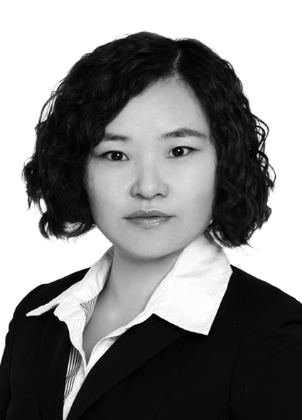

Fang Wang is an Associate Professor at the Institutes of Science and Development Chinese Academy of Sciences. She obtained a PhD in Economics in the [Friedrich Schiller University Jena](https://www.uni-jena.de/en/) (Germany) in 2011.

After doing her PhD at the Graduate College "The Economics of Innovative Change", a program jointly offered by the Max Planck Institute of Economics and the University of Jena, Fang worked as a Post-Doctoral Researcher at the University of Jena and the Zeppelin University successively. In 2010/2011, Fang worked as a Visiting Scholar at the Columbia University in the City of New York.

Her main research interests are Economics of innovation, Science & Technology Policy, and Applied microeconomics. The topic of her doctoral dissertation is "International Trade, Learning, and Firm Heterogeneity: Theory and Evidence from Developing Economies".

